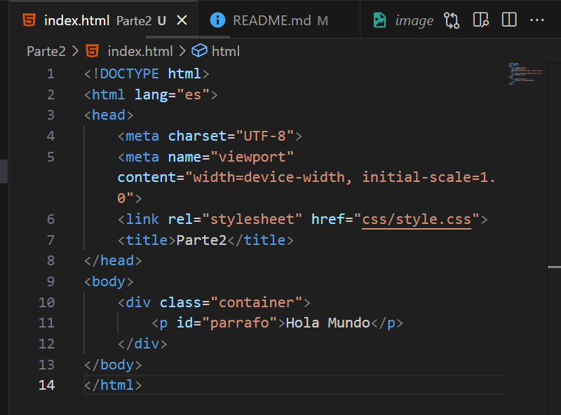
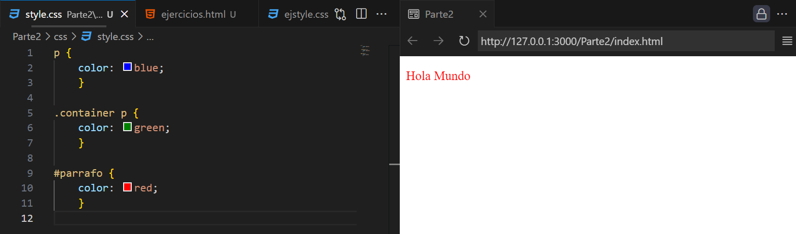
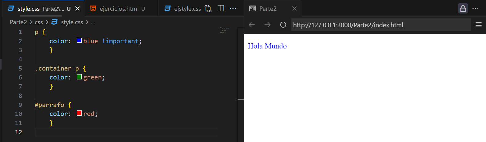
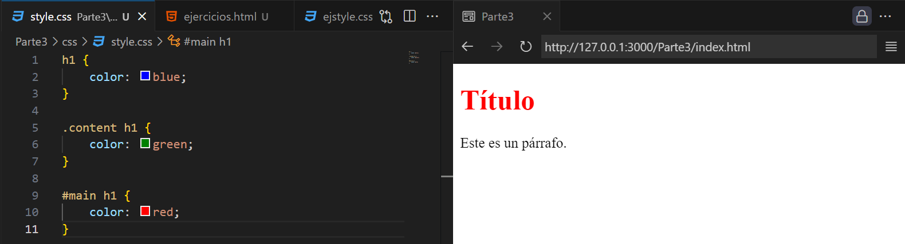
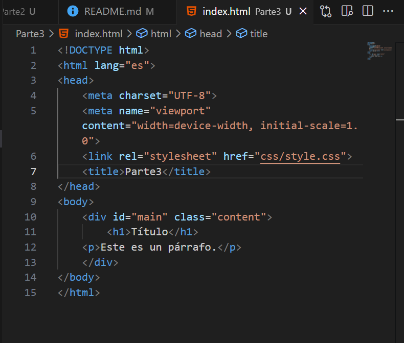
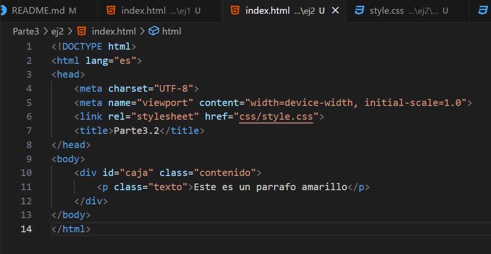
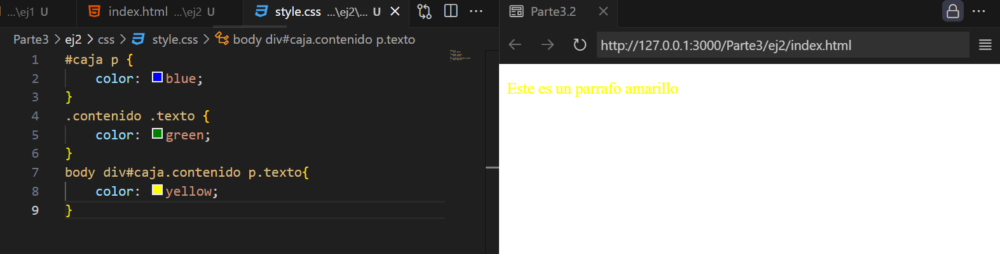

# Taller-de-especificidad

Parte 1: Introducción Teórica a la Especifidad
-
  ¿Qué es la Especifidad? 
     -La especificidad es la suma de diferentes valores según el tipo de selector que se utice, y es necesaria cuando múltiples reglas de estilo intentan aplicar propiedades diferentes al mismo elemento en una página, generando conflicto en CSS porque solo un conjunto de reglas puede aplicarse para cada propiedad de un elemento, así el navegador decide cuál regla aplicar por medio de la especifidad. 
     -Los selectores básicos ayudan al definir estilos en elementos y son importantes en la especificidad, ya que se asignan diferentes valores a cada tipo de selector, y estos valores se suman para determinar qué reglas tienen prioridad. 
     Reglas de cálculo de Especifidad 
     -Selectores de ID (#id): Aportan 100 puntos de especificidad, tienen una especificidad muy alta, porque son únicos por página. 
     -Selectores de clase, atributos y pseudoclases: Cada uno tiene un valor de 10 puntos, porque, son menos específicas que los ID, pero más específicas que los selectores de elementos. 
     -Selectores de elementos y pseudoelementos: Cada uno tiene un valor de 1 punto, porque, se suelen utilizar para aplicar estilos generales a etiquetas específicas. 
     -Selectores universales, combinadores y pseudoclases negadas: No afectan la especifidad. 
     -!important: Css sigue un orden en cascada y especifidad, pero, cuando hay un !important en una regla se aplica como prioridad, pero, si múltiples reglas tienen !important, el navegador calcula la especificidad para aplicar una.

Parte 2: Ejemplos prácticos
-
La especifidad es determinada por los distintos selectores: 
     
El resultado esperado del color del texto es rojo porque el id parrafo tiene mayor valor en el cálculo de especifidad. 
     
Al agregar un !important, el resultado cambia, volviendose el texto azul por que actúa como prioridad. 
     

Parte 3: Ejercicios prácticos
-
  Ejercicio 1, Calulando la Especifidad: 
     Al ser dado el siguiente código, se pide el cálculo de la especificidad y determinar que estilos se aplicarán. 
      
      
     El título es rojo ya que el Id aplicado suma 101 de especificidad, mientras que los demás son menores 
     Ejercicio 2, Resolviendo Conflictos de Especifidad: 
      
      
     El titulo se vuelve amarillo porque se aplica al estilo por Id un estilo por clase y la suma de especificidad pasa de 101 a 110, sin la necesidad de !important.
  
Parte 4: Desafío final
-
  Desafío, Diseñando una página completa con Estilos Conflictivos:
  
Parte 5: Revisión y discusión
  Conclusión: 
     En conclusión, la especificidad es una herramienta en CSS que permite un control  sobre el diseño, y la resolución de conflictos en el navegador; el cálculo de especificidad se basa en como entre más específica sea una regla, más alta será la prioridad. Entender los selectores permiten tener un mayor dominio del diseño; !import funciona como una regla prioritaria y se sobreescribe a otras a menos que también tengan !import.